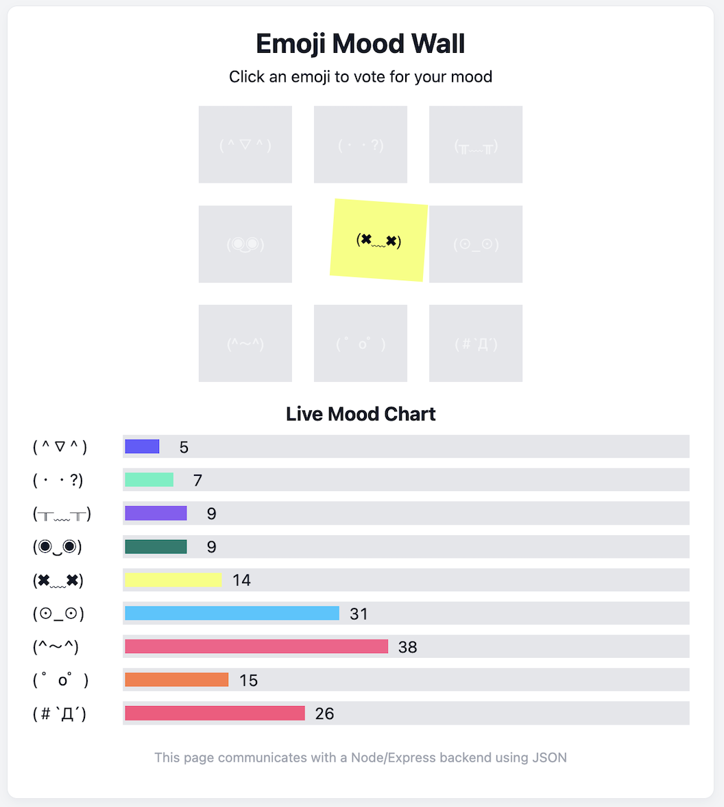

# Emoji Mood Wall



## Live Demo

https://emoji-mood-wall-production.up.railway.app

---

A small full-stack project where people can vote on how they’re feeling using emoji and see the results update in real time.

I built this mostly to understand how the frontend, backend, and database connect together in a simple full-stack app.

---

## What it does

- Displays a list of emoji moods  
- Users can vote for how they feel  
- Results are shown as live vote bars  
- Votes are stored in a SQLite database  
- Each user can vote once per day  
- New moods can be added dynamically  

---

## Tech stack

### Backend
- Node.js  
- Express  

### Database
- SQLite (`better-sqlite3`)

### Frontend
- JavaScript  
- HTML + CSS  

---

## How it works

The frontend sends requests to an Express API.

Example flow:


User clicks emoji
↓
Frontend sends POST /api/moods
↓
Server validates vote
↓
SQLite database updates count
↓
Frontend fetches updated results
↓
Bars re-render in the UI


The server also tracks votes so users can only vote **once per day**.

---

## API

### Get current mood counts


GET /api/moods


Returns:

```json
{
  "(＾▽＾)": 3,
  "(・・?)": 1
}
Vote for a mood
POST /api/moods

Body:

{
  "emoji": "(＾▽＾)",
  "voterId": "uuid"
}
Add a new mood
POST /api/moods/add

Body:

{
  "emoji": "😴"
}
```

## Run locally

Clone the repo and install dependencies:

npm install

Start the server:

npm run dev

Open:

http://localhost:5001

## Why I made this

I wanted to better understand how a simple full-stack app actually fits together, including:

Building an API with Express

Connecting a database

Handling frontend → backend requests

Storing and updating data

Preventing spam votes

Possible future improvements

Input validation with Zod

Security headers with Helmet

Automated API tests

WebSocket updates instead of polling

Better mobile layout
